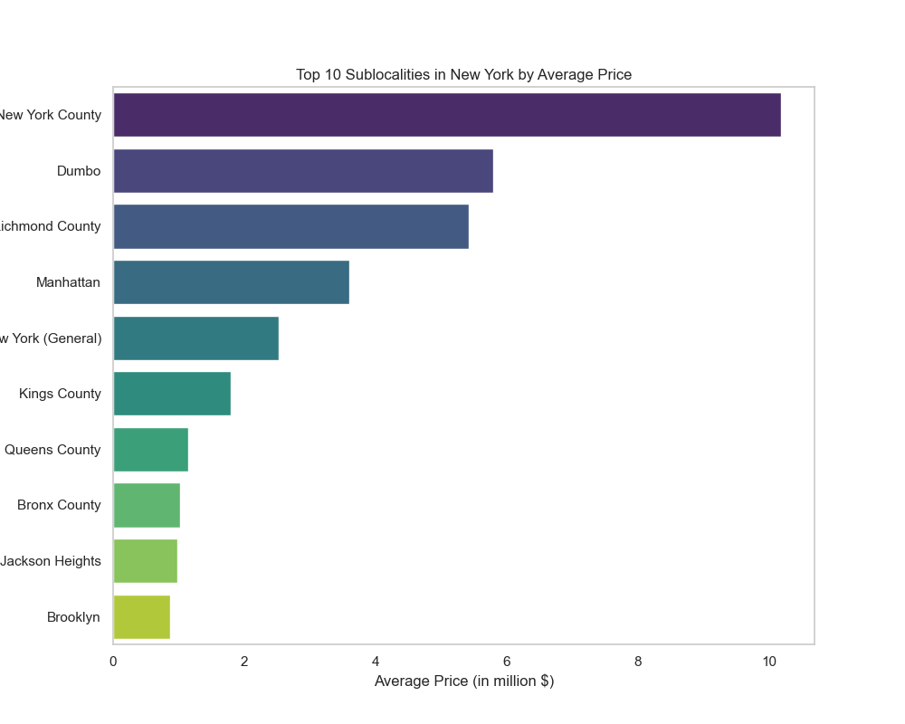
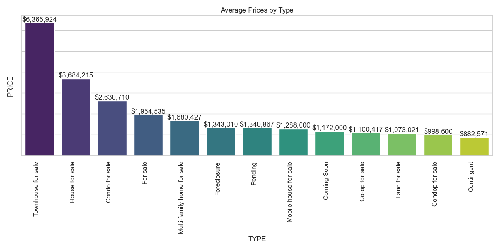
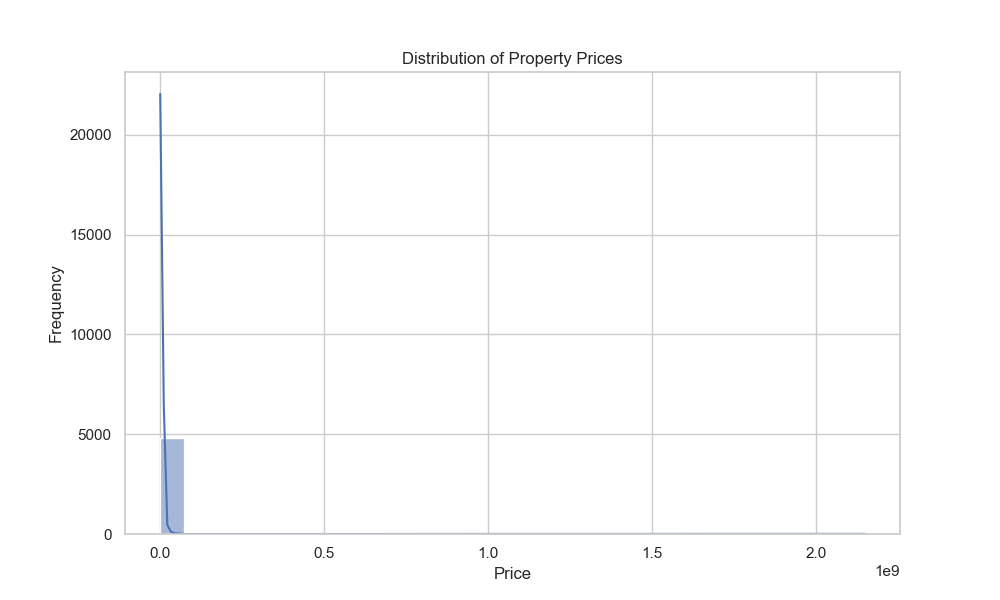
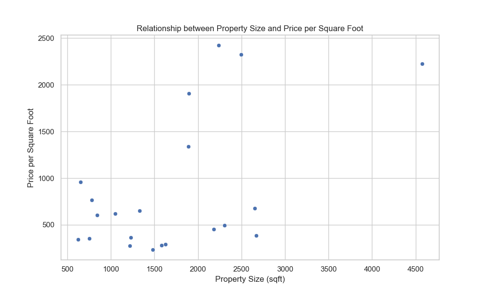
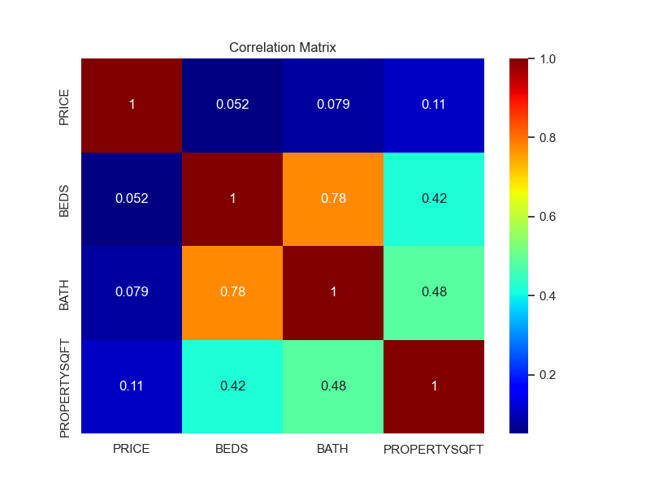

# New-York-Housing-Market-Analysis-and-Prediction

## About Section:
This project involves analyzing the New York housing market dataset to gain insights into various factors affecting property prices. It includes data cleaning, exploratory data analysis (EDA), visualization, and building predictive models to estimate housing prices.

## Problem Statement:
The project aims to understand the factors influencing housing prices in different areas of New York City and to build predictive models to estimate housing prices based on various property features.

## Tools Used:
- Pandas
- NumPy
- Matplotlib
- Seaborn
- Plotly Express
- Statsmodels
- Scikit-learn

## Analysis Done:

- Data Cleaning
- Visualization of top sublocalities by average price and average prices by property type
- Iterative analysis
- Correlation Matrix
- Model building using linear regression and random forest regression
- Model evaluation and comparison
- Cross-validation to assess model performance

 

